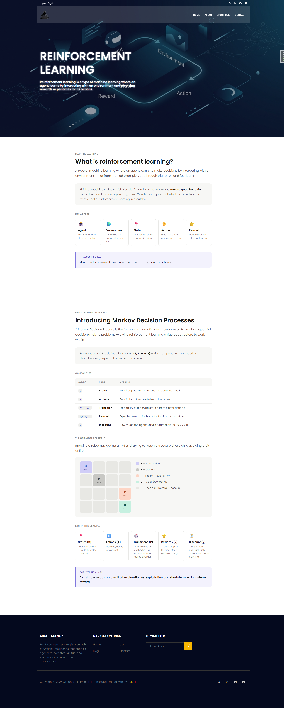
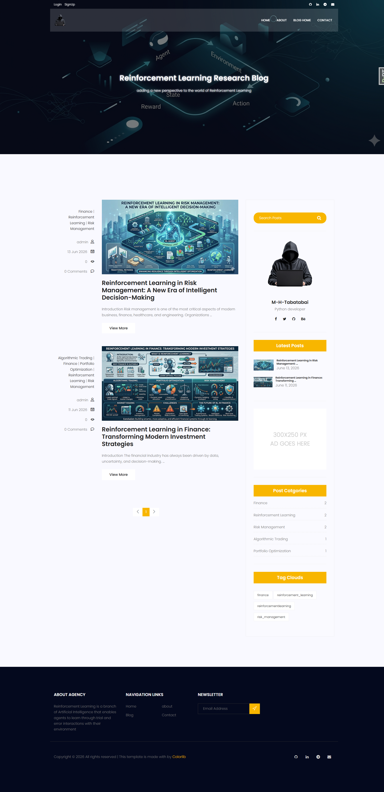
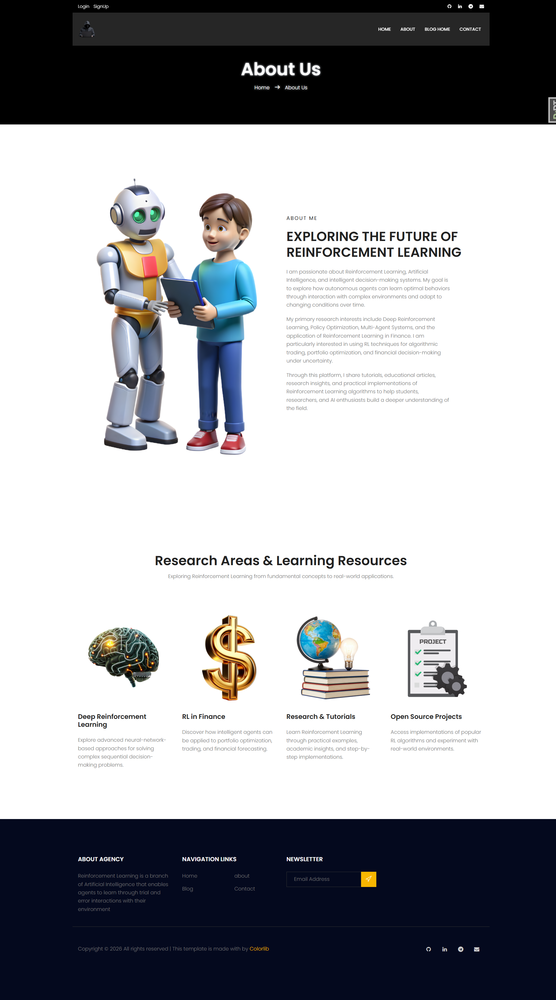

# 🚀 Django Blog Site

<div align="center">

# 🌐 Modern Django Blog Platform

*A feature-rich, responsive, and SEO-friendly blogging platform built with Django.*

<p>
  
  
  
  
  
</p>

**Built for developers, bloggers, educators, and AI enthusiasts.**

⭐ Star this repository if you find it useful!

</div>

---

# 📖 Overview

This project is a modern blogging platform developed with **Django 5**. It combines content management, authentication, media handling, and SEO best practices into a clean and extensible architecture.

## 🎯 Ideal Use Cases

| Use Case             | Supported |
| -------------------- | --------- |
| Personal Blog        | ✅         |
| Tech & AI Articles   | ✅         |
| Educational Platform | ✅         |
| Portfolio Website    | ✅         |
| News Portal          | ✅         |
| CMS Foundation       | ✅         |

---

# ✨ Key Features

| Category          | Features                                   |
| ----------------- | ------------------------------------------ |
| 📝 Blog           | Posts, Featured Images, Categories, Tags   |
| 👤 Authentication | Login, Logout, Admin Authentication        |
| 💬 Interaction    | Comment Support                            |
| 🔍 SEO            | Sitemap, Robots.txt, Clean URLs            |
| 🛡 Security       | CSRF Protection, CAPTCHA                   |
| 🎨 Media          | Image Uploads, Static & Media Files        |
| ⚡ Developer Tools | Django Extensions, Debug Toolbar, Humanize |

---

# 🏛️ Project Architecture

```text
                    +----------------------+
                    |      Django App      |
                    +----------+-----------+
                               |
          +--------------------+--------------------+
          |                    |                    |
          |                    |                    |
+---------v--------+  +--------v---------+  +-------v--------+
|    accounts      |  |       blog       |  |    website     |
| Authentication   |  | Posts & Tags     |  | Static Pages   |
+------------------+  +------------------+  +----------------+
          \                    |                    /
           \                   |                   /
            +-------------------------------------+
            |      Templates / Static / Media     |
            +-------------------------------------+
```

---

# 🗂️ Project Structure

```text
Blog_Site_Django/
│
├── accounts/
├── blog/
├── website/
├── templates/
├── static/
├── media/
├── mysite/
├── manage.py
└── requirements.txt
```

---

# 🛠️ Technology Stack

| Layer            | Technology              |
| ---------------- | ----------------------- |
| Backend          | Django 5                |
| Language         | Python                  |
| Database         | SQLite                  |
| Image Processing | Pillow                  |
| Tags             | django-taggit           |
| CAPTCHA          | django-simple-captcha   |
| SEO              | django-robots & Sitemap |
| Development      | django-debug-toolbar    |
| Frontend         | HTML5, CSS3, JavaScript |

---

# ⚡ Quick Start

```bash
git clone https://github.com/m-h-tabatabai/Blog_Site_Django.git

cd Blog_Site_Django

python -m venv venv

# Activate virtual environment

pip install -r requirements.txt

python manage.py migrate

python manage.py createsuperuser

python manage.py runserver
```

Open:

* **Website:** http://127.0.0.1:8000/
* **Admin:** http://127.0.0.1:8000/admin/

---

# 📊 Feature Checklist

| Feature             | Status |
| ------------------- | :----: |
| User Authentication |    ✅   |
| Blog Posts          |    ✅   |
| Categories          |    ✅   |
| Tags                |    ✅   |
| Comments            |    ✅   |
| Image Upload        |    ✅   |
| XML Sitemap         |    ✅   |
| Robots.txt          |    ✅   |
| CAPTCHA             |    ✅   |
| Responsive Layout   |    ✅   |
| Admin Dashboard     |    ✅   |

---

# 🚀 Deployment Checklist

Before deploying to production:

* ✅ Set `DEBUG = False`
* ✅ Configure `ALLOWED_HOSTS`
* ✅ Secure `SECRET_KEY`
* ✅ Run `python manage.py collectstatic`
* ✅ Configure your web server (Nginx/Apache)
* ✅ Use Gunicorn or another WSGI server
* ✅ Enable HTTPS

---

# 🧾 Django Blog Project

## 🏠 Home Page


## 📰 Blog Page


## ℹ️ About Page


## 📄 Contact Detail


# 🤝 Contributing
---

Contributions are always welcome!

1. Fork the repository
2. Create a feature branch
3. Commit your changes
4. Push to your fork
5. Open a Pull Request

---

# 📄 License

This project is licensed under the **MIT License**.

---

<div align="center">

### 👨‍💻 Built with ❤️ using Django & Python

If you like this project, don't forget to **⭐ Star the repository!**

</div>
